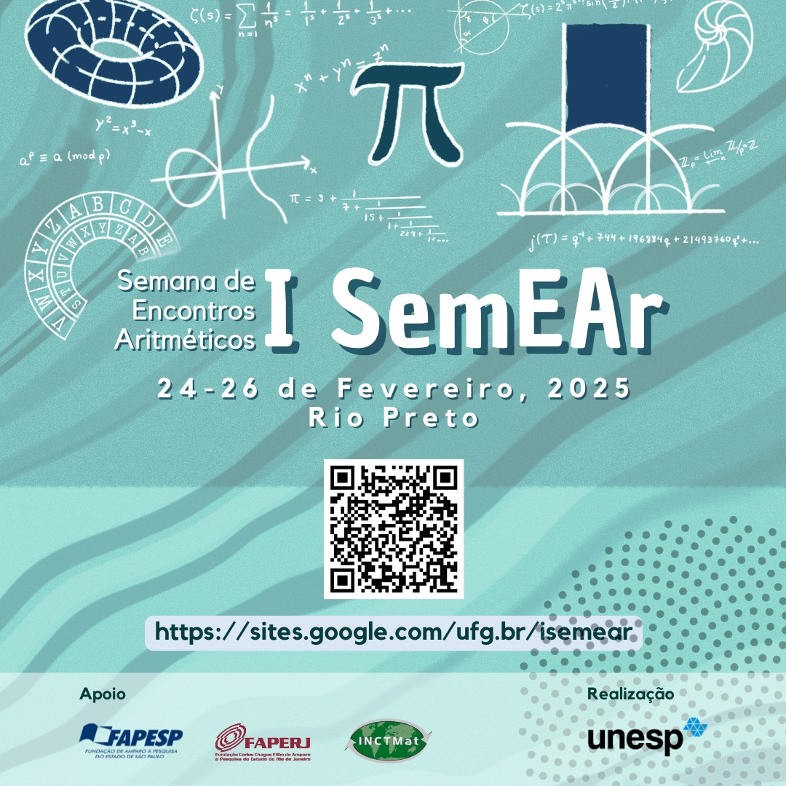

---
#
# By default, content added below the "---" mark will appear in the home page
# between the top bar and the list of recent posts.
# To change the home page layout, edit the _layouts/home.html file.
# See: https://jekyllrb.com/docs/themes/#overriding-theme-defaults
#
layout: home
---

Assistant professor at <a href="https://www.ime.unicamp.br/en" target="_blank">IMECC - Unicamp</a>, currently supported by a <a href="https://bv.fapesp.br/en/auxilios/108313/periods-and-algebraicity/" target="_blank">FAPESP Young Investigator Grant</a>. I am part of IMECC's <a href="https://geotop.ime.unicamp.br/" target="_blank">Geometry and Topology (GeoTop)</a> research group.

I work in the areas of Number Theory and Algebraic Geometry, mainly on questions involving periods of algebraic varieties and their differential equations, modular forms, transcendence, and algebraicity.

I did my PhD at the <a href="https://www.imo.universite-paris-saclay.fr/fr/" target="_blank">LMO - Université Paris-Saclay</a>, under the supervision of <a href="https://www.imo.universite-paris-saclay.fr/~jean-benoit.bost/Accueil.html" target="_blank">Jean-Benoît Bost</a>, and I was a postdoc at the <a href="https://www.mpim-bonn.mpg.de/" target="_blank">MPIM - Bonn</a> and at the <a href="https://www.maths.ox.ac.uk/" target="_blank">MI - University of Oxford</a>, working with <a href="https://www.maths.ox.ac.uk/people/francis.brown" target="_blank">Francis Brown</a>.

A recent <a href="assets/pictures/dieppe.jpg" target="_blank">photo</a>. A less recent <a href="assets/pictures/diploma.png" target="_blank">photo</a>. My <a href="http://lattes.cnpq.br/6649828487224147" target="_blank">Lattes CV</a> (in Portuguese).

<h4>
	SemEAr
</h4>

I helped to organise the first <i>Semana de Encontros Aritméticos</i>, which took place in Rio Preto-SP from 24 to 26 February 2025.  <a href="https://sites.google.com/ufg.br/isemear/" target="_blank">More information.</a> .

<h4>
	Contact information
</h4>

	tfonseca at unicamp.br

 

IMECC - Unicamp  
Departamento de matemática  
Rua Sérgio Buarque de Holanda, 651, Cidade Universitária  
13083-859 Campinas-SP, Brazil  

<h5>
	Last update: 08/08/2025
</h5>
